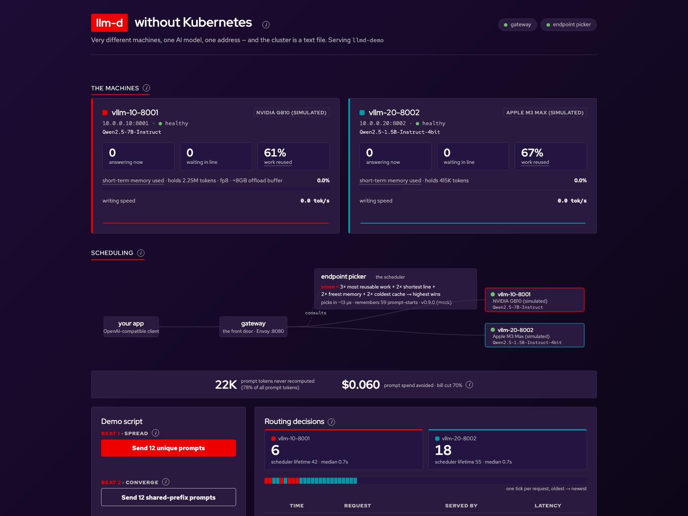

# llm-d without Kubernetes

A laptop-friendly demo of [llm-d](https://github.com/llm-d/llm-d)'s
**file-based endpoint discovery**: the full llm-d routing plane (Endpoint
Picker + Envoy) running with **no Kubernetes anywhere**, intelligently
load-balancing one model across whatever hardware you have — starting with a
single MacBook Pro.

A Red Hat-branded live dashboard visualizes every scheduling decision: an
animated request-flow topology, per-worker cards showing the real underlying
model, KV-cache/queue/throughput meters and a **"work never redone" bar**
(each machine's own cached-vs-recomputed token split, in tokens *and*
dollars), pool-wide prefix-cache savings counters, click-to-expand "why did
the scheduler pick that worker?" score bars, and a chat with
**conversational memory** — watch a
conversation pin itself to the worker whose KV cache holds its history, then
clear the memory and watch the pin release.

Based on ["No Kubernetes? No Problem — llm-d Now Runs Anywhere"](https://medium.com/@ezrasilvera/no-kubernetes-no-problem-llm-d-now-runs-anywhere-8b56b43e714c)
and the official [no-kubernetes-deployment guide](https://github.com/llm-d/llm-d/tree/main/guides/no-kubernetes-deployment).



> Personal demo project — not an official llm-d or Red Hat product. It runs
> llm-d's published images and configs, and uses Red Hat's
> [open-licensed fonts](https://github.com/RedHatOfficial/RedHatFont) (OFL).

## What you need

| Tier | Hardware | What you get |
|---|---|---|
| **Zero** | Any machine | `MOCK=1` — the full dashboard with a simulated pool. No Docker, no GPUs. |
| **One Mac** | 1× Apple Silicon Mac (16 GB+) | Real llm-d routing across **two Metal vLLM workers on the same Mac**. All demo beats work. |
| **Two+ Macs** | Apple Silicon Macs on one LAN | Real network routing across machines. |
| **Heterogeneous** | + any NVIDIA box (Linux / WSL2 / DGX) | The "one scheduler, very different accelerators" story. |

Hub prerequisites: Docker (Desktop or colima), Python 3.12, Xcode CLT
(vllm-metal builds from source on first install). Everything else is
installed by the scripts.

## Quickstart

### Zero-hardware (just the dashboard)

```bash
./demo mock     # → http://localhost:7080 — simulated pool, no Docker, no GPUs
```

(Or by hand, e.g. on Windows without WSL:
`pip install -r webapp/requirements.txt` then `MOCK=1 python webapp/server.py`.)

### One Mac (the real thing)

```bash
./demo up
```

That runs preflight checks, starts Envoy + the llm-d Endpoint Picker in
Docker, installs vllm-metal (first run only — it builds vLLM, go get coffee),
starts **two** Metal workers with a safe memory split, writes the pool file,
and launches the dashboard. It prints the URL when ready.

> **First model load and API startup can take several minutes.** The scripts
> wait and say so — a quiet log is not a hang.

### Add more machines

On each extra Mac:

```bash
./demo worker            # installs vllm-metal if needed, starts a worker
```

It prints the exact join command to run on the hub, e.g.:

```bash
./demo pool add 192.168.1.23:8001 "Apple M2 Pro · Metal"
```

The Endpoint Picker live-reloads the pool — the new machine appears on the
dashboard within seconds, no restarts. NVIDIA boxes join the same way: start
any `vllm serve` with `--served-model-name llmd-demo` bound to `0.0.0.0`
(see `scripts/` for DGX and WSL2 examples), then `./demo pool add`.

Addresses must be **literal IPv4** — the file-discovery plugin deliberately
does not resolve hostnames. Workers must be reachable from the hub's Docker
containers, so use LAN IPs, not `127.0.0.1`.

> **Network note:** by design, everything here binds `0.0.0.0` with no
> authentication — the gateway (8080), the workers (8001+), and the dashboard
> (7080) are open to anyone on your network. Run it on a LAN you trust.

## ⚠️ Metal memory safety (read this once)

vllm-metal's default memory fraction (`auto` → **0.9** on the paged-attention
path) budgets ~90% of unified memory and allocates the KV pool **eagerly at
startup**. On a Mac that's also running your apps, that can wire more memory
than is free and **freeze the entire machine** until the hardware watchdog
reboots it (we learned this the hard way). The scripts here always set an
explicit fraction, split it across local workers, and refuse to start when
the budget doesn't fit free memory. Don't bypass them with a bare
`vllm serve` unless you set `VLLM_METAL_MEMORY_FRACTION` yourself.

## The stage script

See [docs/stage-script.md](docs/stage-script.md) for the full talk track.

1. **Spread** — 12 unique prompts fan out across workers (load-aware scoring;
   watch the animated dots alternate).
2. **Converge** — 12 prompts sharing one long prefix pin to a single worker
   (prefix-cache affinity; watch the "tokens never recomputed" and dollar
   counters climb).
3. **Reshape the pool** — `./demo pool add|remove` while traffic flows; the
   topology reshapes live. *The cluster is a file.*
4. **Overflow** (needs an offload-enabled worker) — 8 big documents overflow a
   deliberately small GPU KV tier and spill into vLLM's offload buffer; replay
   them and watch "restored from offload" climb instead of recompute. Enable on
   a CUDA worker with `OFFLOAD_GB=16 NUM_GPU_BLOCKS=2048` (see
   `scripts/spark/start-vllm.sh`); unified-memory machines can't host this one
   (see troubleshooting).
5. **A sticky conversation** (encore) — chat a few turns: the memory line names
   the worker holding the conversation's KV cache, every turn lands there, and
   *Clear memory* frees the scheduler again. Every chat rides a system prompt
   (as real apps do) — that's what pushes each conversation's prefix past the
   EPP indexer's 256-byte block size so affinity can engage.

The routing panel also shows live **warm-vs-cold latency medians** and a
**round-robin counterfactual** ("N of the last M requests would have missed the
warm cache under round-robin — ~X reused tokens preserved by routing"), and
pressing **`c`** toggles a presenter caption bar that narrates the latest
event for the room.

## How it works

```
your app ──► Envoy :8080 ──► chosen worker (vLLM)
                │  ext_proc (gRPC)
                ▼
        Endpoint Picker :9002 ◄── config/endpoints.yaml  (watchFile)
                └── scrapes each worker's /metrics
```

- **EPP (Endpoint Picker)** — llm-d's scheduler
  (`ghcr.io/llm-d/llm-d-router-endpoint-picker:v0.9.0`, multi-arch). Discovers
  workers from `config/endpoints.yaml` (file-discovery plugin — no Kubernetes
  `InferencePool`), scrapes vLLM metrics, and scores every request:
  `2× queue + 2× kv-cache + 3× prefix-cache + 2× no-hit-lru → max-score-picker`
  (see `config/epp-config.yaml`).
- **Envoy** — asks the EPP where to send each request (ext_proc), forwards via
  `ORIGINAL_DST`, and echoes `x-llmd-served-by` on responses so the dashboard
  can attribute every decision.
- **`config/endpoints.yaml` is the entire cluster state**, generated from
  `config/pool.txt` by `scripts/mac/gen-endpoints.sh` (which probes and skips
  dead endpoints — a listed-but-dead worker looks *idle* to the scheduler and
  attracts traffic).

## Repo layout

```
demo                   # the CLI: up / mock / worker / pool / status / down / doctor
config/
  pool.txt             # pool membership: ip:port|device  (yours; gitignored)
  endpoints.yaml       # generated — what the EPP actually reads
  epp-config.yaml      # EPP: file-discovery + scoring profile (from the official guide)
  envoy.yaml           # Envoy: ext_proc → EPP, ORIGINAL_DST routing
docker-compose.yml     # the routing plane (EPP + Envoy)
macvllm/               # Apple Silicon worker: vllm-metal (Metal GPU), safe-start scripts
scripts/               # gen-endpoints + NVIDIA examples (DGX, Windows/WSL2)
webapp/                # FastAPI + vanilla-JS dashboard (Red Hat dark, self-hosted fonts)
docs/                  # stage script
```

## Troubleshooting

- **Chrome won't load `localhost:7080`** but curl works → some proxy setups
  refuse loopback; use the LAN IP the CLI prints.
- **Worker "hangs" after the engine loads** → vllm-metal's API server can take
  minutes to register routes on some machines. It's not stuck; the health wait
  covers it.
- **A worker gets traffic but every request fails** → it's listed in
  `endpoints.yaml` but dead. Rerun `./demo pool list` / `gen-endpoints.sh` —
  they only write live workers.
- **EPP decisions** → `docker logs -f llmd-epp`. The
  "TPOT calculation" errors on non-streaming requests are cosmetic.
- **Identical prompts all hit one worker** → that's prefix-cache affinity
  working (it's Beat 2). Note the EPP's prefix indexer matches in 256-byte
  blocks: a shared prefix shorter than ~256 chars scores zero and won't
  converge — that's also why the chat carries a system prompt.
- **Chat conversations don't pin** → check the webapp was started by `./demo`
  (the system prompt lives in `webapp/server.py`, `CHAT_SYSTEM_PROMPT`); a
  history of one or two short bare turns is under the indexer's block size.
- **KV offloading (`OFFLOAD_GB`)** → only meaningful on discrete-GPU workers
  (small VRAM, big host DRAM). On unified-memory machines — Apple Silicon,
  DGX Spark — "GPU" and "CPU" are the same physical RAM, so CPU offload buys
  nothing; raise the worker's memory fraction instead. vllm-metal doesn't
  implement the connector anyway (engine init fails).

## Credits

[llm-d](https://llm-d.ai) is a CNCF Sandbox project founded by Red Hat,
Google Cloud, IBM Research, CoreWeave and NVIDIA. Benchmark claims shown on
the dashboard are the project's own — see the
[llm-d README](https://github.com/llm-d/llm-d) and
[blog](https://llm-d.ai/blog).

Licensed under [Apache-2.0](LICENSE). Red Hat fonts under the
[SIL OFL](webapp/static/fonts/LICENSE).
